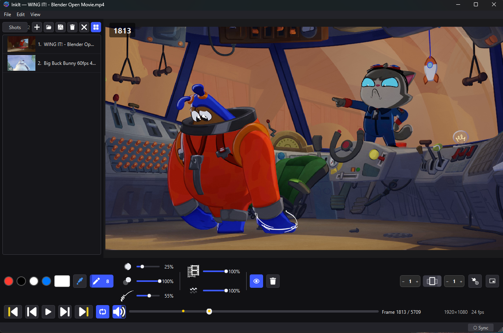
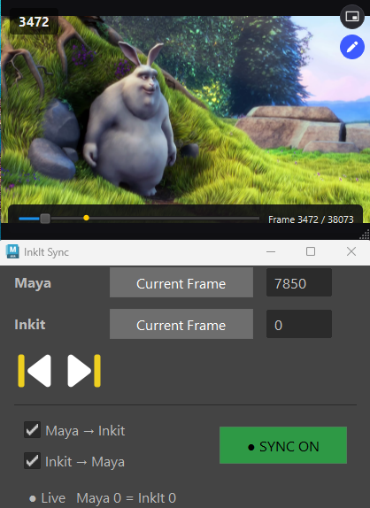
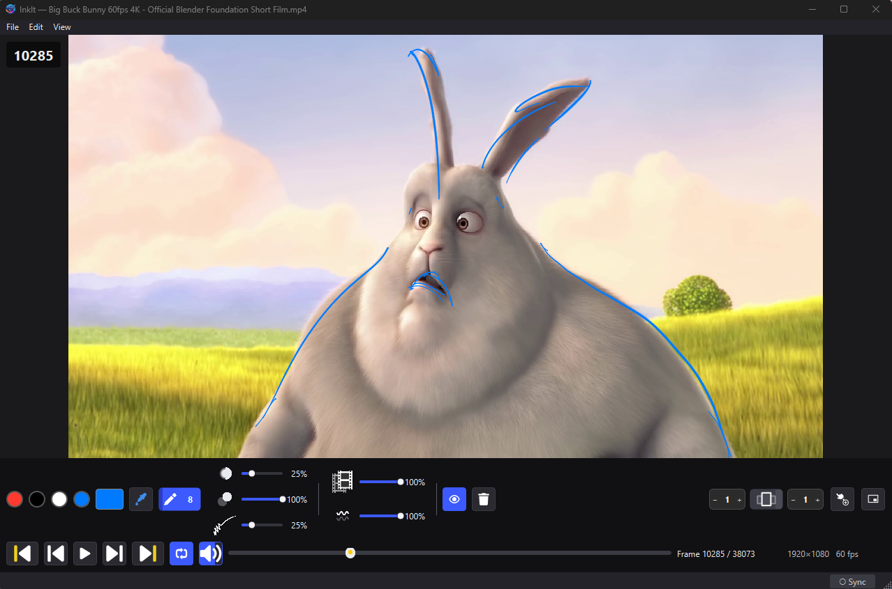

# InkIt

**InkIt** is a local, video and image annotation and animation-review player for Windows. It lets you draw directly on top of video frames — frame by frame — the way animators annotate dailies, boards, and animatics. It is fully self-contained: one executable, no Python, FFmpeg, or Qt install required.

InkIt was designed as a lightweight, frame-accurate companion for reviewing and marking up sequence work, and it pairs tightly with Autodesk Maya for live, two-way frame syncing during animation review.
it also autosave based on each stroke so you never lose the notes, 
you can share the .json file, with others and if location of the clips are on same path, it just opens the flowlessly.

I have design this based on my own way of working with wacom, and I believe it's very easy to adjust to it.

Since I work on Maya most of the time, I can use this tool as a video reference player, that syncs with your notes.

I haven't test it on other machine and just saving it here for a back up, so please test it and leave me some feedback. 

I would love to continue improving it.

If you are an UI/UX artists and interested in the tool please get in touch to make it look better.

---

## Screenshots

| Annotating a sequence | Reviewing in Maya Sync | Frame-accurate review |
| :---: | :---: | :---: |
|  |  |  |

---

## What you can do with InkIt

### Draw on your footage
- **Pen & Eraser** with adjustable **brush size**, **hardness** (soft/hard edge), and **opacity** — toggle with a click or the `B` key.
- **Lazy Mouse** stroke stabilization (like Photoshop / Krita stabilizers): a percentage slider that smooths your strokes, with more smoothing at higher values.
- **Custom colors**: pick any color with a screen eyedropper, or use the four quick-access color slots (reassign them with a double-click). Switch slots with keys `1`–`4`.
- **Stylus / tablet friendly**: pressure-sensitive width, eraser tip, barrel buttons, and touch are supported.
- **Undo / Redo** (`Ctrl+Z` / `Ctrl+Shift+Z`) and **Clear Frame** (`Delete`), with per-frame redo history.

### Animate and review frame by frame
- Fine **frame-accurate scrubbing** along the timeline — middle-drag to scrub, and keep dragging forever because the cursor wraps seamlessly across multiple monitors.
- **Playback** with play/pause, frame stepping, **loop**, audio with volume control, and a clickable frames/time readout.
- Quick **jump to the previous/next drawing** frame, plus **onion skinning** to ghost the frames before and after your current drawing.
- A **timeline scrubber** shows small dots above every frame you've drawn on, so you can see progress at a glance.
- **Picture-in-Picture (PiP)**: pop out a small always-on-top mini player that mirrors the main window's drawings, with its own scrubbing, playback, and even a pen to draw directly on the mini view.

### Add notes on top of the picture
- Draw any kind of annotation — notes, camera directions, timing marks, pose breakdowns — on the video, on a still, or on a board.
- Control how it looks: **Notes opacity** and **Clip opacity** (fade the underlying picture so your marks pop), and a **show/hide notes** toggle.
- Persist your work in a lightweight scene file that opens right back up with all frames and strokes intact — with **autosave** in the background so you never lose work.

### Sync to Maya for animation review
- InkIt and Autodesk Maya talk over a local two-way connection, letting you review animation directly against a frame-accurate playblast while keeping both apps in sync.
- Use the **InkIt Sync** panel/shelf button in Maya to match InkIt to Maya's current frame — live, including during playback or scrubbing — with a configurable **frame offset** so Maya frames map exactly to your InkIt frames (offsets are remembered per scene).
- Go straight to the **next/previous drawing** from Maya, and let InkIt drive or follow playback so review stays in lockstep.
- Sync starts **off** on every launch and is enabled only when you turn it on.

### Export & share
- Export the annotated video as **MP4 / MOV** (H.264 + AAC) with your strokes burned in — option to include or exclude the audio track.
- Export stills/boards as **PNG / JPG / BMP**.
- use autosave files to share/or get back to, incase you forgot to save, it's stroke based saves.
- The last export folder is remembered, so round-trips are quick.

### Organize your shots
- A resizable **shot list / queue** panel for staging multiple clips and scenes, with add, open, save, delete, and thumbnail controls for fast switching.
- Load media by drag-and-drop, and double-click an `.inkit` scene to open it.

### Work your way
- Fully **customizable keyboard shortcuts** in the Settings editor — redefine any action to suit your flow.
- **Save your preferences**: colors, brush sizes, opacities, pressure curve, loop behavior, time mode, window layout, recent files — all remembered between sessions.
- A floating **shot/board viewer** and a customizable brush cursor (circle, crosshair, or a custom image) to match how you like to work.
- Reskinnable icons and (for the brave) a clean, single-file codebase you can run directly from source.

---

## Quick start

**Fully compiled, no dependencies:** download the latest `InkIt.exe` from **Releases** and run it. Just double-click — that's it.

**Run from source (developers):**
```
python app.py
```
or double-click `Launch InkIt.vbs` / `Launch InkIt.bat` if you're running from a clone.

**Open media:** hit `Ctrl+O` and pick an `.mp4`, `.mov`, or a still image (`.png`/`.jpg`/`.jpeg`/`.bmp`/`.webp`), or drop a file onto the window. Open saved scenes with `Ctrl+Shift+O`.

**Start drawing:** pick the pen, choose a color and size, and draw. Use `Space` to play, `Left`/`Right` to step frames, and `Down`/`Up` to jump between drawings.

---

## Common workflows

- **Animation dailies review** — load a playblast, scrub frame by frame, and sketch poses/breakdown notes with onion-skin context, then export for the team.
- **Maya-assisted review** — keep InkIt synced to Maya's viewport and mark up exactly the frame Maya is showing, jumping drawing-to-drawing as you go.
- **Storyboard / board notes** — open still boards, layer pose and camera notes on top, and save reusable scenes.
- **Shot breakdown and handoff** — queue all the shots for an asset, mark each up, and export annotated passes to share with the pipeline.

---

## Requirements

- **Windows** (64-bit). 
- **Compiled executable:** none — everything is bundled (Python, Qt, OpenCV, and FFmpeg are embedded).
- **From source:** Python 3 with PySide6, OpenCV, numpy, and QtMultimedia (see `requirements.txt`).

---

## Building from source

The executable is built once with PyInstaller from the bundled spec and released to **Releases**. If you edit the source and want to rebuild, run:

```
pyinstaller --clean --noconfirm InkIt.spec
```

---

## Notes

- Scene files use the `.inkit` extension and are auto-associated so double-clicking opens InkIt.
- Autosaves are written to `Documents/InkIt/Autosave` and are listed in **File ▸ Autosaves**.
- Settings live in `%APPDATA%\InkIt\settings.json`; icon PNGs can be replaced in the app's icon folder/AppData `icons` directory.
- Light theme is currently disabled — InkIt runs in a clean dark theme (more themes to come).
